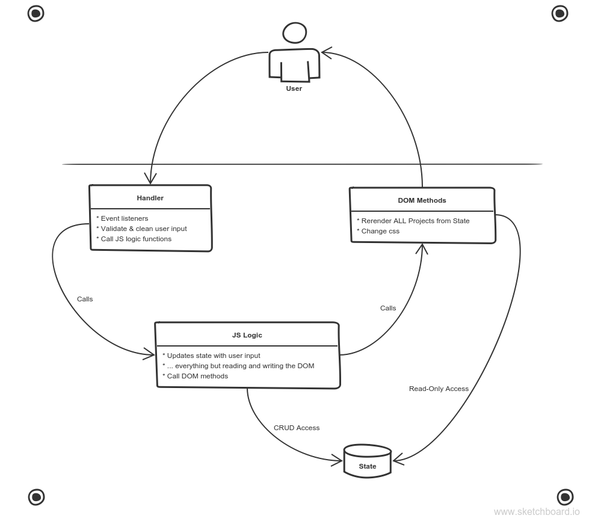

# Portfolio FaceLift: State & Components

Don't waste your time working on two projects at once - learning from one, and maintaining your portfolio with the other.  In Portfolio FaceLift you'll kill two birds with one stone by rebuilding your portfolio from scratch using an omega-clean State-Based Architecture.

### Index
* [Learning Objectives](#learning-objectives)
* [Requirements](#requirements)
* [Resources](#resources)

---

## Learning Objectives

* DOM Manipulations
* jQuery
* UI Components
* App = Data + User Interactions
* State = Truth
* CRUD
* State-Based Architecture

### UI Components

Components are "chunks" of your website that are structurally the same, but with different information connected to them. Your project boxes are a perfect example: they have identical html/css configuration but a different title, image, and hyperlinks.

We will take this concept to the next level by writing a jQuery method that takes a repo name & image url as arguments and appends a new project component to the end of a "projects" div.

### App = Data + User Interactions

An _application_ is (roughly):
> Code that defines & enables user interactions with stored data. 

Pretty straight forward after all!  In this project you will be exploring how to build your application to implement clean behavior-flow & protect your data's integrity using the 

### State = Truth

Your new portfolio will have _state_ (data).  This will be either an object that keeps track of what is currently displayed on your portfolio (ie. the repo name & image url for each featured project).  

The state should be the final source of truth in your application. There should never be a mismatch between what's displayed on the screen and what's stored in your portfolio's _state_.  

### Create, Read, Update, Delete

These are the elementary operations for accessing and using data.  Your portfolio will allow a user to:
  * Create new featured projects
  * View all featured projects
  * Update the image for a featured project
  * Delete a featured project from the DOM

### State-Based Architecture

Your new portfolio's architecture is designed to protect the State, and to make sure that the user is always seeing on the screen an accurate representation of what's stored in State.

Three simple but _sooper_ important aspect of this design are:
1. Only the JS logic can modify the State, triggered by user events
2. DOM methods have "Read-Only Access" to the State
3. There will be only one DOM method that renders from state, and it will re-render the entire "projects" div every time it is called.  

These three features together will ensure that the State is only modified when & how it's supposed to be, that everything in state makes it to the DOM, and that there is never any out-of-date information hanging around in the DOM.

 

[TOP](#index)

---

## Requirements

1. Learn some jQuery on FreeCodeCamp, using W3 Schools as a reference.
2. Refactor 2-3 of your Organizing Development projects to have a little more interactivity:
  * Develop on a new branch
  * Update the README
  * Update the gh-pages demo
3. Plan and develop a new portfolio for your home page:
    * Repo Specs:
      * Branches:
        1. Move your old portfolio to a new branch
        2. Develop your new portfolio on a new branch
        3. Merge your new portfolio to Master when it's finished
      * README
        * About this project
        * Present your development planning like before
        * Learning notes
      * Document your code and functionality
      * Tests for any pure JS, don't worry about the jQuery
     * Behavioral Specs. A user can ...
        * Change the image for any given project box
        * Choose between a couple style options for the whole site
        * Add new project components to the portfolio by providing:
          * A valid repo name (ie. one you actually have)
          * A valid image url
        * Delete a project component
        * See a pre-selected set of projects on window.onload
        * Change the image for an existing project component
    * Your source code will have ...
        * A state object containing the info for each project you want displayed on load -> {0: {repo: name, image: url}}. This will have only properties, no methods.
        * A file for all user input handlers
        * A file for all pure JS logic
        * A file for all jQuery that writes to the DOM
        * A folder for test cases and test library

Challenges: A user can ...
  * See your existing repositories via the GitHub API
  * Filter that list by API-supported criteria
  * Star, fork, clone, or watch a project from your portfolio
  * Validate repo names when a user tries to create a new component

[TOP](#index)

---

## Resources

The DOM:
* [W3 Schools](https://www.w3schools.com/js/js_htmldom.asp)

jQuery:
* [W3 Schools](https://www.w3schools.com/jquery/default.asp)
* [FreeCodeCamp](https://www.freecodecamp.org/challenges/learn-how-script-tags-and-document-ready-work)
* From jQuery:
  * [Learn jQuery](https://learn.jquery.com)
  * [The Docs](http://api.jquery.com)

Programming Paradigm:
* [Event-Driven Programming](https://github.com/elewa-academy/General-Resources/blob/master/programming-resources/programming-and-paradigms/04-event-driven-programming.md)

GitHub API Challenge:
* [Tutorial & Example](http://blog.teamtreehouse.com/code-a-simple-github-api-webapp-using-jquery-ajax)
* [Short Tutorial](http://yonaba.github.io/2012/08/14/List-your-GitHub-projects-using-JavaScript-and-jQuery.md.html)
* [Another Example](https://codepen.io/bvasko/pen/gJxKk)
* [Make it Prettier ](https://nihal111.github.io/2017/07/05/github-jquery.html)
* [Neat API Searches](https://gist.github.com/jasonrudolph/6065289)

[TOP](#index)
___
___
### 

